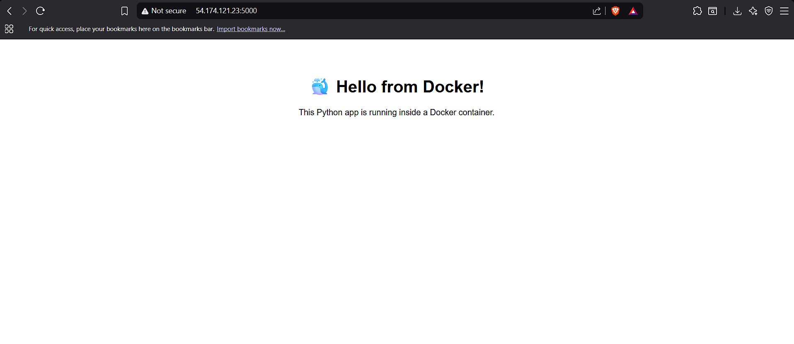
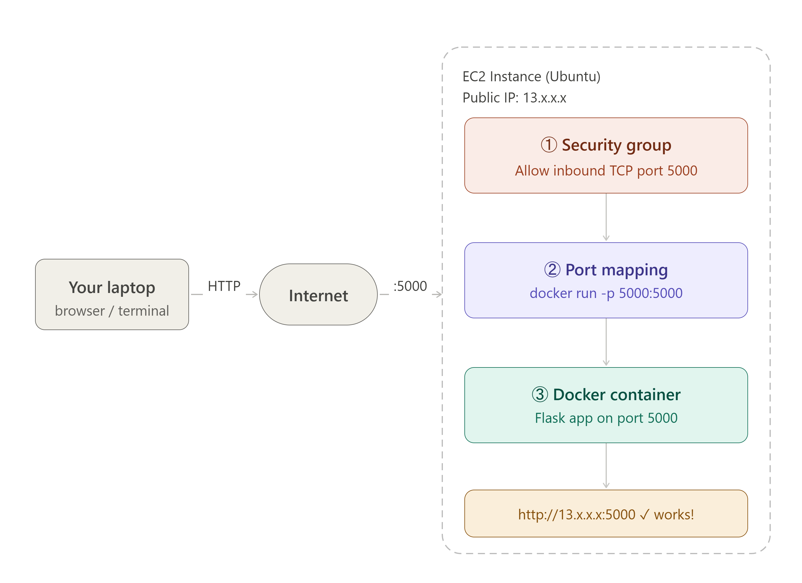

# 🐳 Python Flask App — Dockerized & Deployed on AWS EC2

A beginner-friendly project that demonstrates how to containerize a Python Flask
application using Docker and deploy it live on an AWS EC2 instance.

---

## 🖥️ Live Output



> Flask app running inside a Docker container, accessible via EC2 public IP on port 5000.

---

## 🏗️ Architecture



The request flows through three layers inside the EC2 instance:

| Layer | Role |
|---|---|
| **Security Group** | AWS firewall — allows inbound TCP traffic on port 5000 |
| **Port Mapping** | Docker bridges EC2 port 5000 → container port 5000 |
| **Docker Container** | Flask app running in an isolated container |

---

## 📁 Project Structure

```
python-project/
├── app.py                            # Flask web application
├── Requirements.txt                  # Python dependencies
├── Dockerfile                        # Instructions to build the Docker image
├── ec2_docker_architecture.png # Architecture diagram
├── docker_ec2_output.png             # Live output screenshot
└── README.md
```

---

## 📄 File Breakdown

### `app.py`
```python
from flask import Flask

app = Flask(__name__)

@app.route("/")
def home():
    return """
    <html>
      <body style="font-family: sans-serif; text-align: center; padding: 60px;">
        <h1>🐳 Hello from Docker!</h1>
        <p>This Python app is running inside a Docker container.</p>
      </body>
    </html>
    """

@app.route("/greet/<name>")
def greet(name):
    return f"<h2>Hello, {name}! Greetings from inside Docker 🐳</h2>"

if __name__ == "__main__":
    app.run(host="0.0.0.0", port=5000)
```

### `Dockerfile`
```dockerfile
# Step 1: Start from an official Python base image
FROM python:3.11-slim

# Step 2: Set the working directory inside the container
WORKDIR /app

# Step 3: Copy requirements first (for better caching)
COPY Requirements.txt .

# Step 4: Install Python dependencies
RUN pip install --no-cache-dir -r Requirements.txt

# Step 5: Copy the rest of the app code
COPY . .

# Step 6: Tell Docker which port the app will use
EXPOSE 5000

# Step 7: The command to run when the container starts
CMD ["python", "app.py"]
```

---

## 🚀 Run Locally

### Prerequisites
- [Docker](https://docs.docker.com/get-docker/) installed on your machine

### Steps

**1. Clone the repository**
```bash
git clone https://github.com/Jaydattadupade/simple-python-docker-project.git
cd python-project
```

**2. Build the Docker image**
```bash
docker build -t my-python-app .
```

**3. Run the container**
```bash
docker run -d -p 5000:5000 --name myapp my-python-app
```

**4. Open in browser**
```
http://localhost:5000
http://localhost:5000/greet/YourName
```

---

## ☁️ Deploy on AWS EC2

### Step 1 — Launch an EC2 instance
- OS: **Ubuntu 22.04**
- Instance type: `t2.micro` (free tier)
- Download your `.pem` key pair

### Step 2 — Open port 5000 in Security Group
```
EC2 Console → Your Instance → Security Groups
→ Edit Inbound Rules → Add Rule:
  Type: Custom TCP | Port: 5000 | Source: 0.0.0.0/0
```

### Step 3 — SSH into EC2 and install Docker
```bash
ssh -i your-key.pem ubuntu@<EC2-PUBLIC-IP>

sudo apt update
sudo apt install docker.io -y
sudo systemctl start docker
sudo usermod -aG docker ubuntu
```
> Log out and SSH back in after the last command.

### Step 4 — Copy project files to EC2
```bash
# Run this from your local machine
scp -i your-key.pem -r ./python-project ubuntu@<EC2-PUBLIC-IP>:~/
```

### Step 5 — Build and run on EC2
```bash
cd python-project
docker build -t my-python-app .
docker run -d -p 5000:5000 --name myapp my-python-app
```

### Step 6 — Open in browser
```
http://<EC2-PUBLIC-IP>:5000
```

---

## 🛠️ Useful Docker Commands

| Command | Description |
|---|---|
| `docker ps` | List all running containers |
| `docker ps -a` | List all containers including stopped |
| `docker logs myapp` | View app logs |
| `docker logs -f myapp` | Follow live logs |
| `docker exec -it myapp bash` | Open terminal inside container |
| `docker stop myapp` | Stop the container |
| `docker rm myapp` | Remove the container |
| `docker rmi my-python-app` | Delete the image |
| `docker system prune` | Clean up unused containers & images |

---

## 💡 Key Concepts Learned

- **Dockerfile** — Recipe to build a Docker image
- **Docker Image** — Frozen, shareable snapshot of the app
- **Docker Container** — A running instance of the image
- **Port Mapping (`-p`)** — Connects host port to container port
- **Security Group** — AWS firewall controlling inbound/outbound traffic
- **EC2 Public IP** — Makes the app accessible from anywhere on the internet

---

## ⚠️ Common Mistakes & Fixes

| Error | Cause | Fix |
|---|---|---|
| `COPY failed: file not found` | Filename case mismatch | Match exact filename case in Dockerfile |
| `ERR_CONNECTION_REFUSED` | Missing `-p` flag | Use `docker run -p 5000:5000 ...` |
| Can't reach EC2 public IP | Port not open | Add inbound rule in Security Group |
| `pip install` fails | Typo in filename in `RUN` step | Double-check spelling in Dockerfile |

---

## 📜 License

This project is open source and available under the [MIT License](LICENSE).
